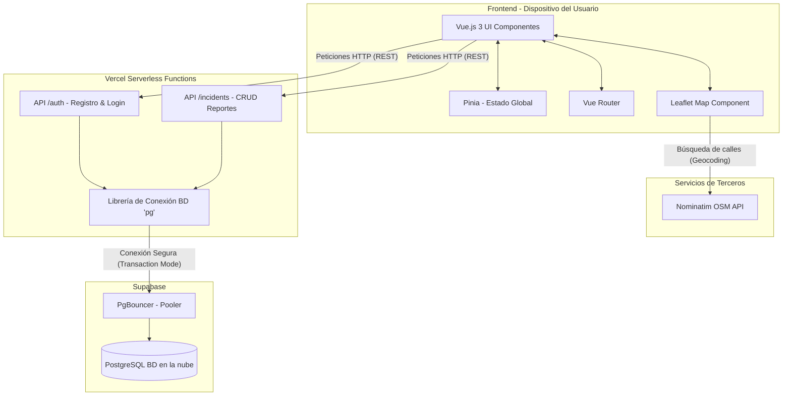

# Arquitectura Técnica y Estrategia de Seguridad

## 1. Diagrama de Componentes

El siguiente diagrama muestra la interacción entre el Frontend (Vue), Backend (Vercel Serverless) y la Base de Datos (Supabase PostgreSQL), integrando la API externa de Nominatim para la búsqueda de calles.

## 2. Justificación del Stack Tecnológico

1. **Frontend (Vue.js 3 + Vite):** Elegido por su curva de aprendizaje suave, excelente reactividad (Composition API) y rapidez de empaquetado (Vite). Permite crear PWA ligeras y modulares, ideales para dispositivos móviles de estudiantes.
2. **Estilos (Vanilla CSS):** Se evitó usar Tailwind o Bootstrap para mantener el bundle final lo más pequeño posible, optimizando la carga en conexiones de internet inestables, mientras se priorizó un diseño limpio, moderno (glassmorphism) e interactivo.
3. **Mapas (Leaflet + OpenStreetMap):** Leaflet es la librería más ligera y compatible para mapas móviles. OpenStreetMap/Nominatim se eligió porque es de código abierto y completamente gratuito, evitando las altas tarifas de Google Maps API que harían inviable el proyecto para una institución sin fines de lucro.
4. **Backend (Vercel Serverless):** Facilita un despliegue sin configuración (zero-config). Las funciones serverless escalan automáticamente y reducen el costo de infraestructura a cero (capa gratuita).
5. **Base de Datos (PostgreSQL en Supabase):** Una base de datos relacional robusta perfecta para modelar relaciones transaccionales (Usuarios -> Incidentes). Supabase ofrece un excelente plan gratuito y un Connection Pooler (PgBouncer) integrado, esencial para arquitecturas Serverless.

## 3. Estrategia de Seguridad

- **Autenticación (JWT):** El login genera JSON Web Tokens (JWT) que el frontend envía en los encabezados HTTP (`Authorization: Bearer <token>`) de cada petición protegida.
- **Autorización por Roles:** La base de datos y la API validan los roles (ESTUDIANTE, AUTORIDAD). Un estudiante no puede modificar el estado de revisión de un reporte, ni una autoridad puede crear reportes a nombre de estudiantes.
- **Hashing de contraseñas:** Nunca se guardan contraseñas en texto plano. Se utiliza la librería `bcryptjs` con un "salt" de costo 12, lo que las hace resistentes a ataques de fuerza bruta.
- **Protección contra Inyección SQL:** Todas las consultas SQL en el backend (`api/_lib/db.js`) utilizan consultas parametrizadas (ej. `SELECT * FROM usuarios WHERE email = $1`), previniendo inyección de código SQL malicioso.
- **Manejo de Variables de Entorno:** Claves como `JWT_SECRET` y `DATABASE_URL` nunca están hardcodeadas en el frontend ni en repositorios públicos. Vercel las inyecta de forma segura directamente al entorno serverless en producción.
- **Comunicaciones Seguras:** Vercel fuerza todo el tráfico de la API y del Frontend a través de HTTPS de manera predeterminada, cifrando los datos (contraseñas, coordenadas geográficas) en tránsito.
